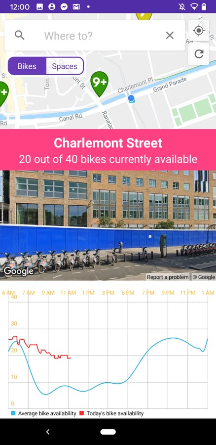

# dBikes Planner


dBikes Planner is an Android journey planning app for cyclists using the Dublinbikes bike-sharing scheme. It allows users to generate cycling routes from their location to a destination, taking into account the availability of bikes at each station.

The back-end for this project is a Flask web server in Python. It uses a microservices approach, building a HTTP API. scikitlearn is used for generating predictions. The app is currently designed to run on Google AppEngine, incorporating many Google Cloud features. CycleStreets and OpenStreetMap are used for generating routes.


The front-end is an Android application. It displays the location and status of each station in Dublin, as well as historical data for a station. Users can input a destination, and will receive a cycling route to reach this destination, incorporating bike-sharing stations. Basic directions are also provided.





This app is currently designed for use in Dublin. It could easily be extended for other international bike-sharing schemes.

## Installation

The back-end is designed to run on a Google Cloud AppEngine instance. It can be deployed using:

```gcloud app deploy```

To function correctly, you will need to set up a bucket to store historical bike data. The data in this repo's ```/data``` folder can be used for this purpose.

The Android app also requires a [Google Maps API key](https://developers.google.com/maps/documentation/javascript/get-api-key). Change the value in the two google_maps_api.xml files to your Google Maps API key.

If you want to download the latest .apk without compiling from source, the [/releases](https://github.com/oisinq/fyp/releases) tab is the place to go.

Have fun!
